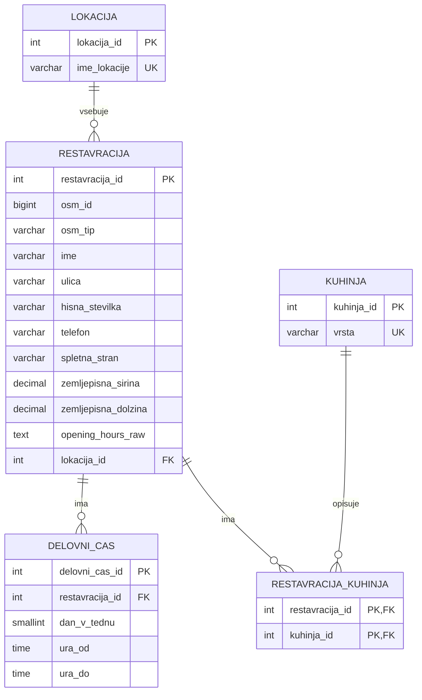

# Iskalnik restavracij po Sloveniji

Projekt pri predmetu **Osnove podatkovnih baz**.

**Avtorici:** Eliza Katarina Pecoraro in Kaja Blažko

## Opis aplikacije

Aplikacija omogoča pregledovanje in iskanje restavracij po Sloveniji. Podatki o restavracijah, lokacijah, vrstah kuhinje in delovnem času so shranjeni v podatkovni bazi PostgreSQL. Spletni del aplikacije je izdelan v Pythonu z ogrodjem Bottle.

Aplikacija je namenjena pregledovanju podatkov, zato za običajno uporabo potrebuje samo bralni dostop do baze prek uporabnika `javnost`.

## Osnovne funkcionalnosti

Uporabnik lahko:

- išče restavracije po imenu, kraju ali vrsti kuhinje;
- filtrira restavracije po lokaciji, vrsti kuhinje in dnevu v tednu;
- prikaže samo restavracije, ki imajo telefonsko številko, spletno stran ali podatek o delovnem času;
- pregleduje rezultate po straneh;
- odpre podrobnosti posamezne restavracije;
- vidi naslov, vrste kuhinje, telefonsko številko, spletno stran in delovni čas;
- odpre lokacijo restavracije na zemljevidu.

## Tehnologije

- Python 3.10 ali novejši
- Bottle
- PostgreSQL
- psycopg2
- HTML in CSS
- OpenStreetMap oziroma Overpass API za pridobitev začetnih podatkov

## Lokalni zagon aplikacije

### 1. Kloniranje repozitorija

```bash
git clone https://github.com/elizapecoraro/OPB-projekt.git
cd OPB-projekt
```

Vse nadaljnje ukaze je treba izvajati iz korenske mape projekta.

### 2. Ustvarjanje virtualnega okolja

```bash
python -m venv .venv
```

Aktivacija virtualnega okolja:

**Windows PowerShell**

```powershell
.venv\Scripts\Activate.ps1
```

**Windows Command Prompt**

```cmd
.venv\Scripts\activate.bat
```

**macOS ali Linux**

```bash
source .venv/bin/activate
```

### 3. Namestitev knjižnic

```bash
python -m pip install --upgrade pip
python -m pip install -r requirements.txt
```

### 4. Nastavitev povezave z bazo

V korenski mapi projekta naredite datoteko `.env`. Najlažje je kopirati priloženo datoteko `.env.example` in jo preimenovati v `.env`.

Vsebina datoteke naj bo:

```dotenv
DB_HOST=baza.fmf.uni-lj.si
DB_PORT=5432
DB_NAME=sem2026_kajabl
DB_USER=javnost
DB_PASSWORD=
```

Datoteka `.env` ni vključena v repozitorij. Aplikacija jo ob zagonu samodejno prebere.

### 5. Zagon

```bash
python app.py
```

V brskalniku odprite:

```text
http://localhost:8080
```

Aplikacijo ustavite s kombinacijo `Ctrl+C`.

> Profesorju za uporabo aplikacije ni treba ustvarjati tabel ali ponovno uvažati podatkov. Datotek `Data/create.sql`, `Data/download_osm.py` in `Data/import_osm.py` pri običajnem zagonu ne poganjajte.

## Kratka navodila za uporabo

1. Na začetni strani v iskalno polje vnesite ime restavracije, kraja ali vrste kuhinje.
2. Po potrebi izberite lokacijo, vrsto kuhinje ali dan v tednu.
3. Z dodatnimi možnostmi omejite prikaz na restavracije s telefonom, spletno stranjo ali delovnim časom.
4. Pritisnite gumb za iskanje oziroma filtriranje.
5. Za več informacij kliknite posamezno restavracijo.
6. Na strani s podrobnostmi lahko odprete spletno stran restavracije ali njeno lokacijo na zemljevidu.

## Dostop do podatkovne baze

Aplikacija se mora povezovati z uporabnikom `javnost`. Ker aplikacija podatke samo bere, ta uporabnik potrebuje pravico za povezavo z bazo, uporabo sheme in branje vseh tabel aplikacije.

Naslednje ukaze mora enkrat izvesti lastnik baze:

```sql
GRANT CONNECT ON DATABASE sem2026_kajabl TO javnost;
GRANT USAGE ON SCHEMA public TO javnost;

GRANT SELECT ON TABLE
    lokacija,
    restavracija,
    kuhinja,
    restavracija_kuhinja,
    delovni_cas
TO javnost;

ALTER DEFAULT PRIVILEGES IN SCHEMA public
GRANT SELECT ON TABLES TO javnost;
```

Enaki ukazi so shranjeni tudi v datoteki `Data/grant_javnost.sql`.

## ER-diagram



Povezave med tabelami:

- ena lokacija ima lahko več restavracij;
- ena restavracija ima lahko več zapisov delovnega časa;
- restavracija ima lahko več vrst kuhinje, posamezna vrsta kuhinje pa je lahko povezana z več restavracijami;
- povezavo mnogo-proti-mnogo med restavracijami in kuhinjami predstavlja tabela `restavracija_kuhinja`.

## Struktura projekta

```text
OPB-projekt/
├── app.py                         # zagon spletne aplikacije in poti
├── requirements.txt               # potrebne zunanje knjižnice
├── .env.example                   # primer nastavitev povezave z bazo
├── Data/
│   ├── database.py                # povezava s PostgreSQL
│   ├── create.sql                 # izdelava tabel; samo za vzdrževalca baze
│   ├── grant_javnost.sql          # pravice za javnega uporabnika
│   ├── download_osm.py            # prenos podatkov OSM
│   ├── import_osm.py              # uvoz podatkov v bazo
│   └── models.py                  # podatkovni modeli
├── Services/
│   └── restavracija_service.py    # poizvedbe in poslovna logika
├── Presentation/
│   ├── views/                     # HTML-predloge
│   └── static/                    # CSS in druge statične datoteke
└── docs/                          # dokumentacija
```

## Posodabljanje podatkov

Ta korak ni potreben za pregled ali ocenjevanje aplikacije. Namenjen je samo vzdrževalcu baze.

1. `Data/download_osm.py` pridobi podatke iz Overpass API.
2. `Data/create.sql` na novo izdela podatkovno shemo.
3. `Data/import_osm.py` uvozi pridobljene podatke.

**Pozor:** `Data/create.sql` najprej izbriše obstoječe tabele, zato ga ne zaganjajte nad bazo, ki jo želite ohraniti.

## Vir podatkov

Začetni podatki o restavracijah so pridobljeni iz projekta OpenStreetMap.
