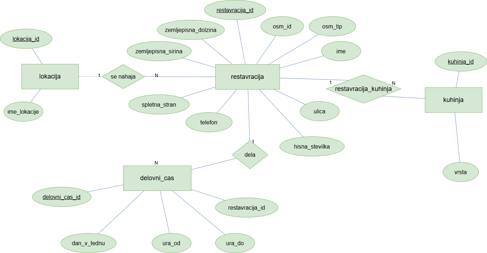

# Restavracije v Sloveniji

Projekt pri predmetu **Osnove podatkovnih baz**.

**Avtorici:** Eliza Katarina Pecoraro in Kaja Blažko

## Opis projekta

Spletna aplikacija prikazuje restavracije v Sloveniji na podlagi podatkov iz OpenStreetMap.

Uporabnik lahko:

* pregleduje seznam restavracij,
* išče restavracije po imenu, lokaciji ali vrsti kuhinje,
* filtrira rezultate po lokaciji, vrsti kuhinje in dnevu v tednu,
* filtrira restavracije glede na prisotnost telefonske številke, spletne strani ali delovnega časa,
* pregleduje podrobnosti posamezne restavracije,
* dostopa do spletne strani restavracije in njene lokacije na zemljevidu OpenStreetMap.


Za osvežitev podatkov je pripravljena skripta `download_osm.py`, ki preko Overpass API prenese aktualne podatke in jih shrani v JSON datoteko, nato pa se podatki uvozijo v PostgreSQL bazo.


Aplikacija uporablja relacijsko podatkovno bazo PostgreSQL ter je razdeljena na podatkovni, storitveni in predstavitveni sloj.

## Zagon aplikacije

Za zagon aplikacije je potrebno:

1. Namestiti odvisnosti:

```bash
pip install -r requirenments.txt
```

2. Ustvariti datoteko `.env` z nastavitvami za povezavo do PostgreSQL baze.

3. Zagnati aplikacijo:

```bash
python app.py
```

Po zagonu je aplikacija dostopna na naslovu:

```text
http://localhost:8080
```

## ER diagram baze


